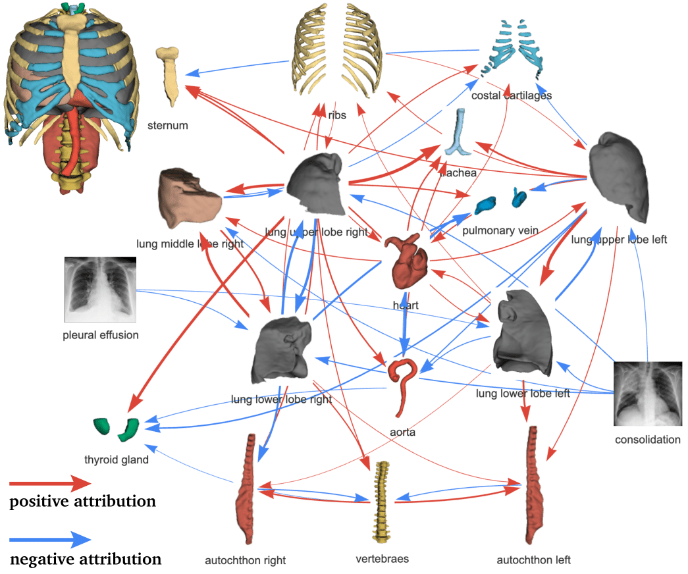
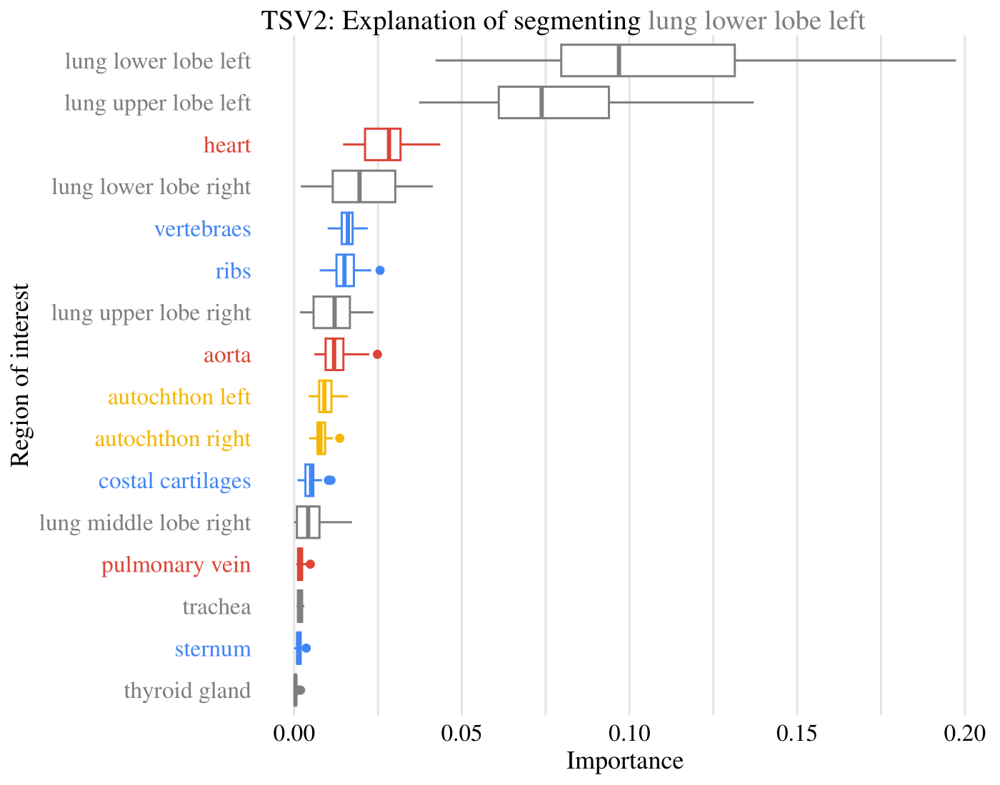
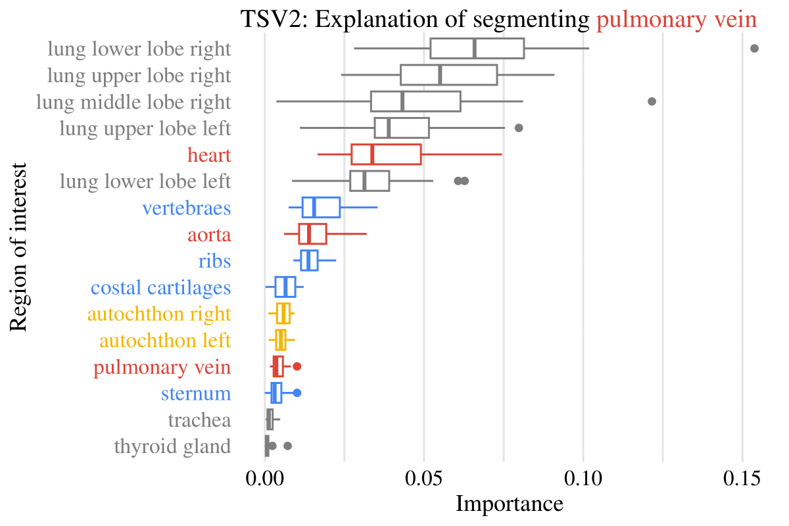

# Aggregated Attributions for Explanatory Analysis of 3D Segmentation Models
This is official code of for paper "Aggregated Attributions for Explanatory Analysis of 3D Segmentation Models". 

# Abstract
Analysis of 3D segmentation models, especially in the context of medical imaging, is often limited to segmentation performance metrics that overlook the crucial aspect of explainability and bias. Currently, effectively explaining these models with saliency maps is challenging due to the high dimensions of input images multiplied by the ever-growing number of segmented class labels. To this end, we introduce Agg$^2$Exp, a methodology for aggregating fine-grained voxel attributions of the segmentation model's predictions. Unlike classical explanation methods that primarily focus on the local feature attribution, Agg$^2$Exp enables a more comprehensive global view on the importance of predicted segments in 3D images. Our benchmarking experiments show that gradient-based voxel attributions are more faithful to the model's predictions than perturbation-based explanations. As a concrete use-case, we apply Agg$^2$Exp to discover knowledge acquired by the Swin UNEt TRansformer model trained on the TotalSegmentator v2 dataset for segmenting anatomical structures in computed tomography medical images. Agg$^2$Exp facilitates the explanatory analysis of large segmentation models beyond their predictive performance. 

# Model
Model used for our experiments was trained on selected and joined thorax classes from [TotalSegmentator-V2 (TSV2) dataset](https://github.com/wasserth/TotalSegmentator).
Code used for training and inference of our Swin Unetr is available at `model` folder. With the following files/folders:
- [`model/data_loader.py`](model/data_loader.py) - data loading and preprocessing
- [`model/inference.py`](model/inference.py) - inference script
- [`model/models`](model/models/) - folder with model definitions
- [`model/train.py`](model/train.py) - training script
# Explanations
Code used for explanations, aggregations and visualizations is available at `explanations` folder.
Files/folders explanations:
- [`explanations/aggregate_explanations_custom_masks.py`](explanations/aggregate_explanations_custom_masks.py) - Aggregates explanations for custom masks
- [`explanations/aggregate_explanations.py`](explanations/aggregate_explanations.py) - Aggregates explanations for all segmentation classes
- [`explanations/analyse_tcsnet.R`](explanations/analyse_tcsnet.R) - R code for visualizations
- [`explanations/attribution_functions.py`](explanations/attribution_functions.py) - Functions for generating attributions
- [`explanations/attributions_evaluation`](explanations/attributions_evaluation/) - folder with code for quantitive evaluation of explanations
- [`explanations/generate_attributions_for_tsv2.py`](explanations/generate_attributions_for_tsv2.py) - generates gradient-based attributions for tsv2
- [`explanations/generate_b50_example_for_all_explanations.py`](explanations/generate_b50_example_for_all_explanations.py) - creates example explanations for all methods
- [`explanations/generate_example_explanations.py`](explanations/generate_example_explanations.py) - 
- [`explanations/generate_kernelshap.py`](explanations/generate_kernelshap.py) - generates attributions for kernelshap
- [`explanations/generation_utils.py`](explanations/generation_utils.py) - utility functions for generating explanations
- [`explanations/get_tsv2_examples_with_all_organs.py`](explanations/get_tsv2_examples_with_all_organs.py) - finds files with all organs in tsv2
- [`explanations/kernelshap_utils.py`](explanations/kernelshap_utils.py) - utility functions for kernelshap
- [`explanations/sliding_window_gradient_inference.py`](explanations/sliding_window_gradient_inference.py) - modification of sliding window inference for gradient-based attributions
- [`explanations/tsv2_train_outlier_analysis.ipynb`](explanations/tsv2_train_outlier_analysis.ipynb) - notebook for outlier analysis

# Example aggregations
Example aggregated explanations are available at `data/tsv2_test_aggregated_sg_explanations_with_dice.csv` file.

# Example Global Aggregated Attributions

